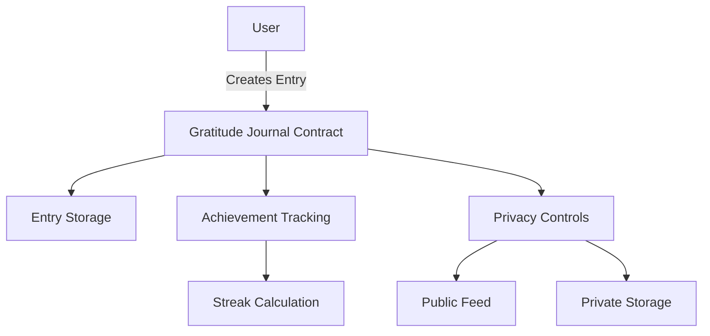

# Gratitude Journal Protocol

A decentralized protocol for recording and managing personal gratitude entries on the Stacks blockchain, featuring mood tracking, privacy controls, and achievement-based incentives.

## Overview

The Gratitude Journal Protocol enables users to create immutable digital gratitude entries while maintaining control over their privacy and building a consistent journaling practice. The protocol combines personal reflection with community engagement through a system of achievements and optional public sharing.

### Key Features
- Immutable gratitude entries with timestamps
- Mood tracking and analysis
- Flexible privacy controls
- Achievement system for consistent journaling
- Community sharing options

## Architecture

The protocol is built around a core smart contract that manages entries, user data, and achievements.



### Core Components
- Entry Management System
- Privacy Control Mechanism
- Achievement Tracking System
- Streak Calculation Logic
- Public/Private Data Segregation

## Contract Documentation

### Gratitude Journal Contract

The main contract handling all gratitude journal functionality.

#### Storage Structure
- `gratitude-entries`: Main storage for journal entries
- `user-entries`: Index of entries per user
- `entry-count`: Counter for user entries
- `user-achievements`: Tracks user achievements and streaks
- `user-last-entry`: Tracks last entry timestamp for streak calculation

#### Access Control
- All entry modifications are restricted to the entry owner
- Public entries are readable by anyone
- Private entries are only accessible to the owner

## Getting Started

### Prerequisites
- Clarinet
- Stacks wallet

### Basic Usage

1. Create a gratitude entry:
```clarity
(contract-call? .gratitude-journal create-entry "I am grateful for..." u8 true)
```

2. Update entry privacy:
```clarity
(contract-call? .gratitude-journal update-privacy u1 false)
```

3. Update entry mood:
```clarity
(contract-call? .gratitude-journal update-mood u1 u9)
```

## Function Reference

### Public Functions

#### `create-entry`
```clarity
(define-public (create-entry (text (string-utf8 500)) (mood uint) (is-public bool)))
```
Creates a new gratitude entry.

#### `update-privacy`
```clarity
(define-public (update-privacy (entry-id uint) (is-public bool)))
```
Updates the privacy setting of an entry.

#### `update-mood`
```clarity
(define-public (update-mood (entry-id uint) (mood uint)))
```
Updates the mood rating of an entry.

#### `delete-entry`
```clarity
(define-public (delete-entry (entry-id uint)))
```
Deletes a specific entry.

#### `claim-streak-achievement`
```clarity
(define-public (claim-streak-achievement))
```
Claims available streak achievements.

### Read-Only Functions

#### `get-entry`
```clarity
(define-read-only (get-entry (owner principal) (entry-id uint)))
```
Retrieves a specific entry.

#### `get-user-entries`
```clarity
(define-read-only (get-user-entries (user principal)))
```
Retrieves all entries for a user.

#### `get-user-achievements`
```clarity
(define-read-only (get-user-achievements (user principal)))
```
Retrieves achievement data for a user.

## Development

### Testing
Run tests using Clarinet:
```bash
clarinet test
```

### Local Development
1. Clone the repository
2. Install dependencies with `clarinet requirements`
3. Start local chain with `clarinet console`

## Security Considerations

### Limitations
- Entry length limited to 500 characters
- Mood values must be between 0 and 10
- Achievement claims are time-locked

### Best Practices
1. Always verify transaction success
2. Keep private entries private by setting `is-public` to false
3. Regular backup of entry IDs
4. Monitor achievement claims for expected behavior

### Data Privacy
- Public entries are visible to everyone
- Private entries are only accessible to the owner
- Entry privacy can be modified at any time
- Consider implications before making entries public